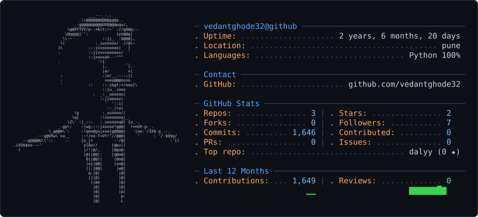

# Hi there, I'm Vedant Ghode 👋

### 🚀 Aspiring Software Engineer | Java Backend Developer | Full-Stack Learner

I'm an engineering student passionate about **software development, backend engineering, and building real-world applications**.

Currently, I'm strengthening my fundamentals in **Java, backend development, databases, JavaScript, and React**, while continuously improving my problem-solving and development skills.

---

## 👨‍💻 About Me

* 🎓 Engineering student focused on software development
* ☕ Currently learning and improving my **Core Java & Backend Development** skills
* 🌐 Learning **JavaScript & React** for frontend development
* 🗄️ Exploring **SQL, databases, JPA & Hibernate**
* 🧠 Practicing **Data Structures & Algorithms** and problem solving
* 🛠️ Interested in building practical, real-world software projects
* 📚 Preparing myself for **software engineering interviews**
* 🚀 Goal: Become a strong **full-stack/software engineer**

---

## 🧑‍💻 Tech Stack

### Languages


### Backend


### Frontend


### Tools


---

## 📚 Currently Learning

```text
Java
 ├── Core Java
 ├── OOP
 ├── Collections
 ├── Exception Handling
 ├── Multithreading
 └── Advanced Java

Backend
 ├── SQL
 ├── JPA
 ├── Hibernate
 └── Backend Development

Frontend
 ├── JavaScript
 └── React

Problem Solving
 └── Data Structures & Algorithms
```


## 🤝 Let's Connect

I'm always interested in **learning, building, and connecting with other developers**.

If you're also learning software development or working on interesting projects, feel free to connect!

---

### 💡 "Learn. Build. Improve. Repeat."


<picture>
  <source media="(prefers-color-scheme: dark)" srcset="dark_mode.svg" />
  <source media="(prefers-color-scheme: light)" srcset="light_mode.svg" />
  
</picture>
